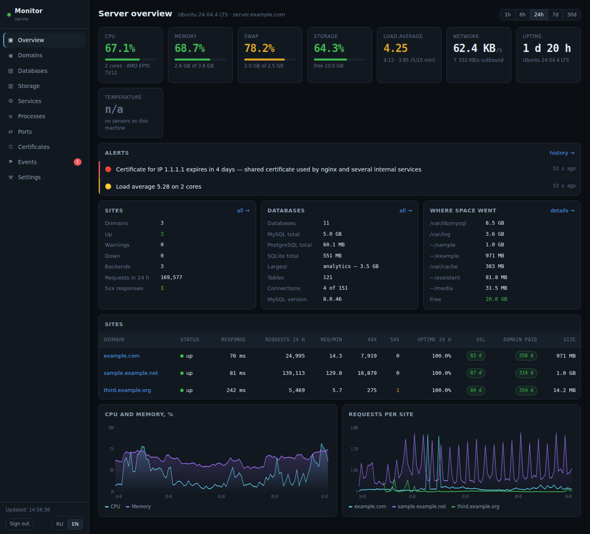
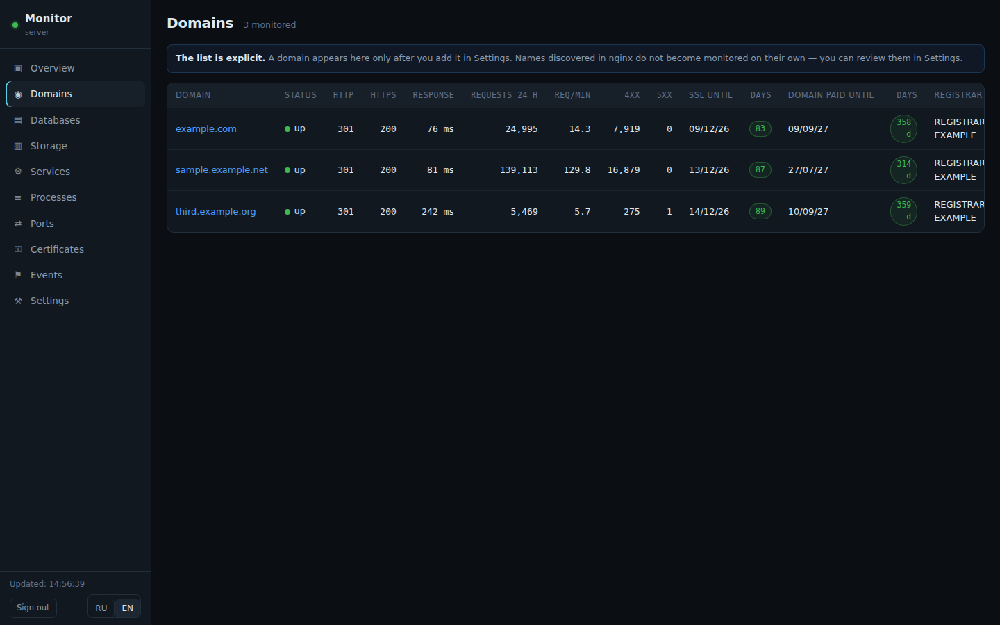
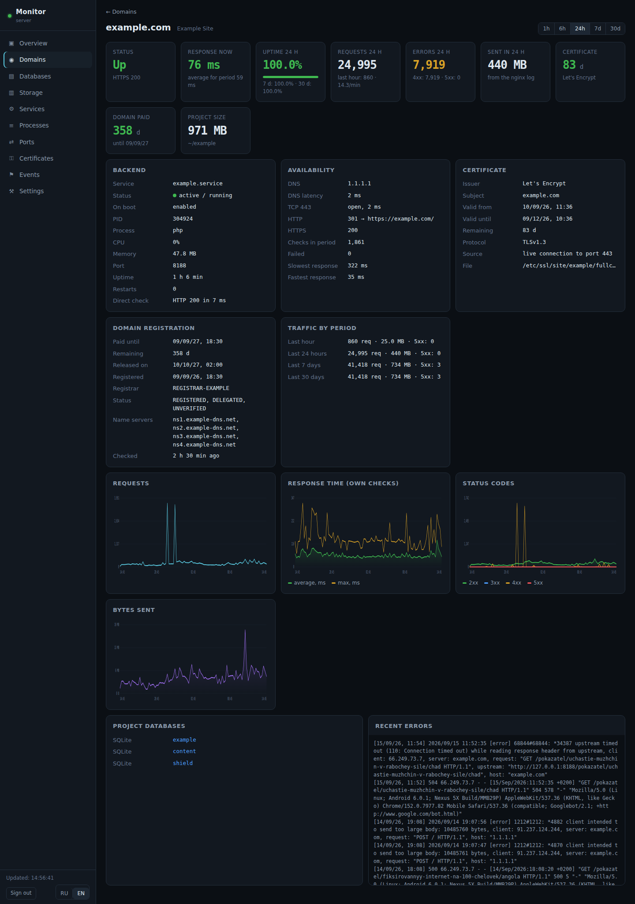
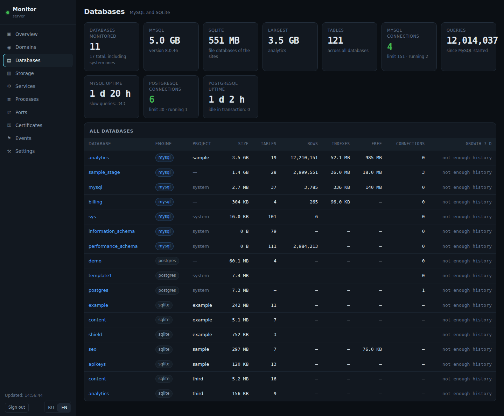
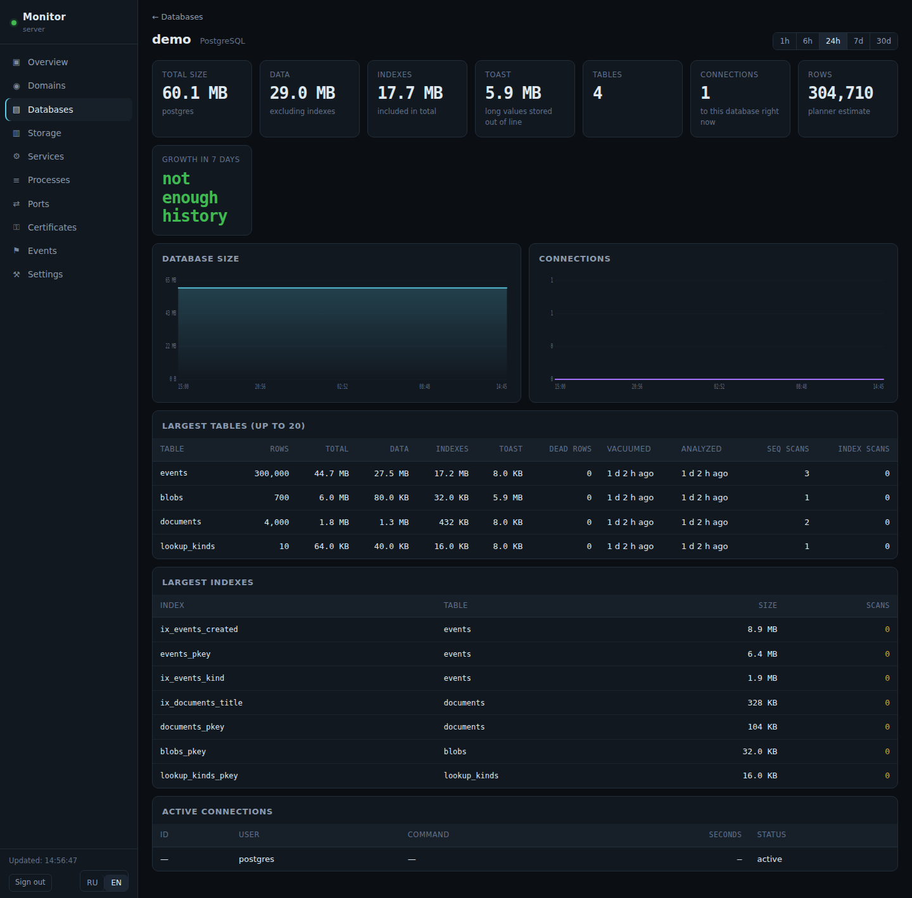
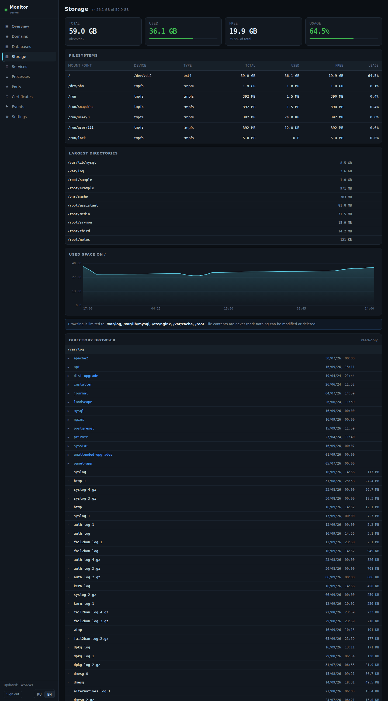
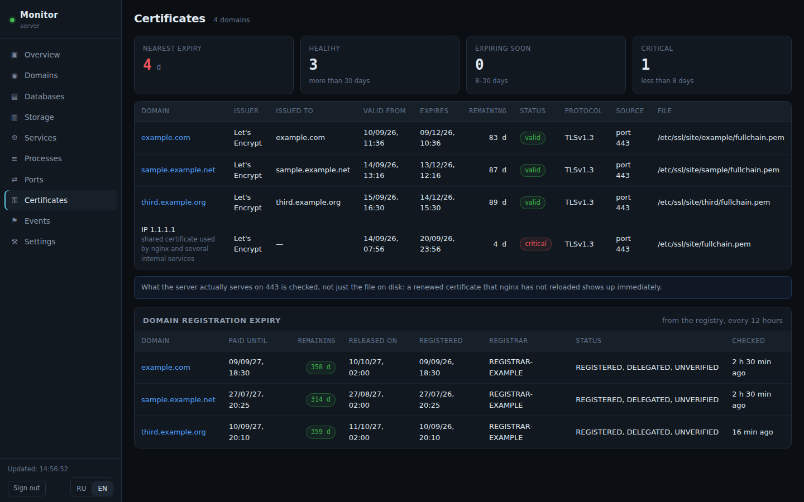
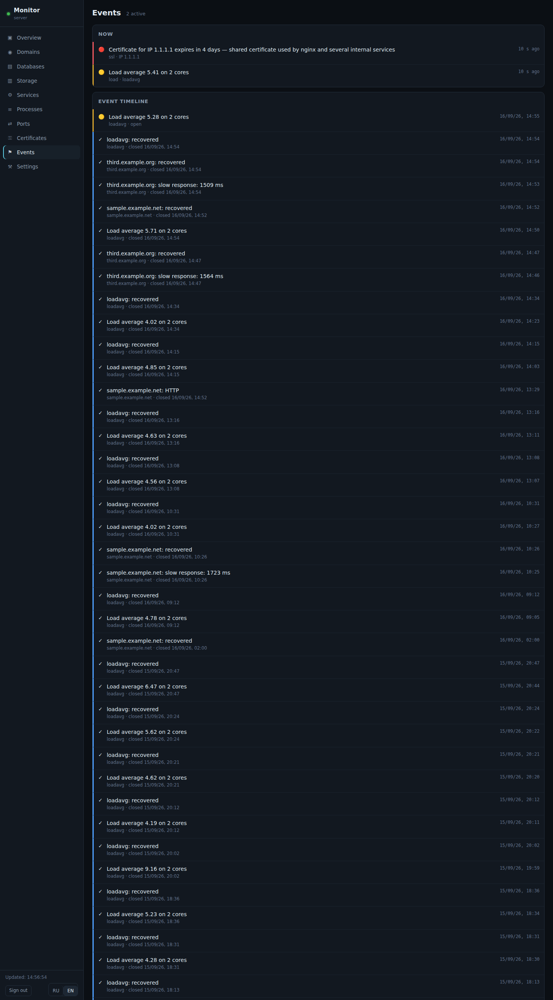
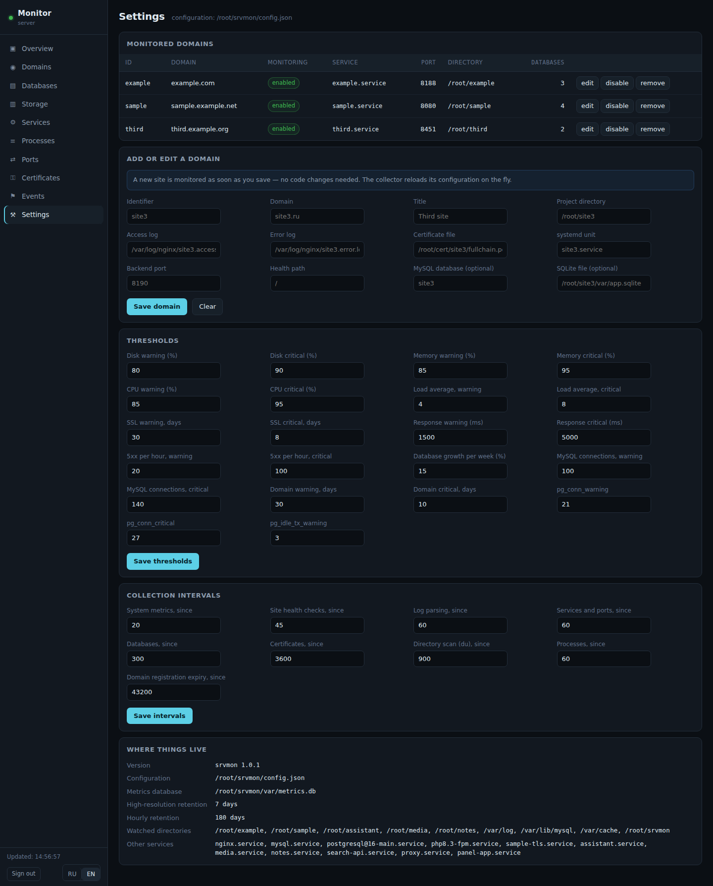
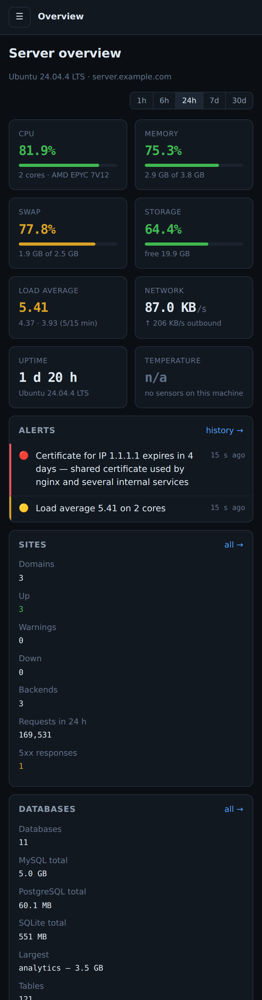

# srvmon

Панель мониторинга для сервера, на котором крутится несколько ваших сайтов.

Одна страница отвечает на вопросы, которые действительно задаёшь: жив ли
сервер, какие сайты работают, какой из них грузит машину, есть ли ошибки,
не кончается ли место, не растёт ли база, не истекает ли сертификат, какая
служба упала.

**[Documentation in English →](README.md)**



<sub>Снимки сделаны с работающей установки при включённом демонстрационном
режиме: числа и графики настоящие, а имена, адреса и пути подменены. См.
[Демонстрационный режим](#демонстрационный-режим).</sub>

---

## Зачем ещё одна панель

Prometheus, Grafana и Zabbix рассчитаны на парк машин. Для одного сервера с
тремя-четырьмя сайтами такой стек оказывается тяжелее того, за чем он следит.
srvmon исходит из обратного:

* **Без зависимостей.** Только стандартная библиотека Python — ни pip, ни
  виртуального окружения, ни сборки фронтенда. Интерфейс — три файла.
* **Дёшево.** Два процесса Python, примерно по 30 МБ памяти, и файл SQLite
  размером в единицы мегабайт. Панель писалась на машине с двумя ядрами и
  3,8 ГБ памяти, рядом с двумя боевыми сайтами.
* **Только чтение.** Ни команд, ни произвольного SQL, ни записи файлов, ни
  `systemctl` из веба. Панель покажет, что служба упала, но поднять её не
  сможет.
* **Никаких выдуманных цифр.** Каждое значение снято с машины. Если что-то
  нельзя измерить при текущей настройке, панель так и говорит, а не
  подставляет правдоподобное.

## Что показывает

| Раздел | Содержимое |
|---|---|
| **Обзор** | Процессор, память, подкачка, диск, очередь задач, сеть, аптайм, температура; сводка по сайтам; сводка по базам; куда ушло место; активные предупреждения |
| **Домены** | Состояние, коды HTTP/HTTPS, время ответа, запросы и запросы в минуту, 4xx и 5xx, аптайм, срок сертификата и срок регистрации домена, бэкенд, порт, объём проекта |
| **Карточка сайта** | Доступность за 24 ч / 7 д / 30 д, трафик по периодам, графики запросов, времени ответа и кодов, процесс бэкенда и его юнит, сертификат, регистрация домена, последние ошибки |
| **Базы данных** | Все базы MySQL, PostgreSQL и SQLite: размер, таблицы, строки, индексы, соединения, рост за неделю |
| **Карточка базы** | Из чего сложился размер (данные, индексы, TOAST), топ-20 таблиц, крупнейшие индексы, активные соединения, история размера |
| **Диск** | Файловые системы, крупнейшие каталоги с приростом за неделю, просмотр дерева каталогов только на чтение |
| **Службы** | Юниты systemd: состояние, автозапуск, PID, память, порты, аптайм, число перезапусков, хвост журнала |
| **Процессы** | Самые заметные процессы по ЦП и памяти, сгруппированные по типу, с замаскированными секретами |
| **Порты** | Слушающие сокеты, какой процесс их держит, наружу или только localhost |
| **Сертификаты** | Издатель, срок действия, остаток дней и отдельная таблица сроков регистрации доменов |
| **События** | Активные предупреждения и лента того, что ломалось и восстанавливалось |
| **Настройки** | Пороги, интервалы сбора и список доменов — правятся прямо в интерфейсе |

Язык интерфейса: **русский и английский**, переключается в боковой панели.


## Как выглядит

| | |
|---|---|
| [](docs/screenshots/domains.png)<br>**Домены** — состояние, время ответа, запросы, ошибки, сроки сертификата и регистрации | [](docs/screenshots/domain.png)<br>**Карточка сайта** — доступность, трафик, графики, бэкенд, сертификат, регистрация |
| [](docs/screenshots/databases.png)<br>**Базы данных** — MySQL, PostgreSQL и SQLite в одном списке | [](docs/screenshots/database-postgres.png)<br>**База PostgreSQL** — данные, индексы и TOAST, мёртвые строки, уборка, крупнейшие индексы |
| [](docs/screenshots/storage.png)<br>**Диск** — файловые системы, крупнейшие каталоги, просмотр только на чтение | [](docs/screenshots/services.png)<br>**Службы** — состояние, память, порты, аптайм, число перезапусков |
| [](docs/screenshots/certificates.png)<br>**Сертификаты** — сроки TLS-сертификатов и сроки регистрации самих доменов | [](docs/screenshots/events.png)<br>**События** — что не так сейчас и лента того, что ломалось и восстанавливалось |
| [](docs/screenshots/settings.png)<br>**Настройки** — пороги, интервалы и список доменов | [](docs/screenshots/mobile.png)<br>**На телефоне** — те же данные в одну колонку |

Разделы «Процессы» и «Порты» намеренно не показаны: даже в демонстрационном
режиме там видны настоящие командные строки и номера портов всего остального,
что работает на машине.

## Что нужно

* Linux с systemd
* Python 3.8 или новее (пакеты не нужны)
* nginx — необязательно: чтобы открыть панель снаружи и чтобы читать
  пожурнальный трафик каждого сайта
* MySQL/MariaDB, PostgreSQL и/или SQLite — необязательно, для раздела баз

Все три движка могут работать одновременно — в списке они идут рядом. Любого
может не быть: раздел просто пропустит отсутствующий. Установленный, но
лежащий сервер баз показывается ошибкой, а не молча пропускается.

## Установка

```bash
git clone https://github.com/ВАШ_АККАУНТ/srvmon.git /opt/srvmon
cd /opt/srvmon
sudo ./install.sh
```

Это вся установка. Скрипт проверит окружение, создаст `config.json`, заведёт
пользователя со сгенерированным паролем, поставит два юнита systemd, запустит
их и напечатает адрес и пароль.

Полезные ключи:

```bash
sudo ./install.sh --port 9000        # другой локальный порт
sudo ./install.sh --user bob         # другой логин
sudo ./install.sh --no-start         # только подготовить
sudo ./install.sh --uninstall        # убрать службы, данные оставить
```

Дальше посмотрите, что на сервере есть, и добавьте нужное:

```bash
python3 tools/discover.py
```

Инструмент покажет найденные имена серверов nginx, прикладные службы,
слушающие порты, базы MySQL и файлы SQLite — как подсказку. **Само по себе
ничто под наблюдение не попадает.** Домены добавляются осознанно, в разделе
Settings, — именно это и делает список осмысленным на сервере с десятком
виртуальных хостов.

## Как открыть снаружи

Панель слушает `127.0.0.1` и на внешнем интерфейсе не появляется. Выберите:

* **Отдельное имя** — скопируйте `nginx.example.conf`, поправьте имена и пути
  к сертификату, перезагрузите nginx. Предпочтительный вариант.
* **Туннель SSH** — настраивать вообще ничего не нужно:
  `ssh -L 8452:127.0.0.1:8452 вы@сервер`, затем открыть `http://127.0.0.1:8452`.
* **Адрес сервера на отдельном порту** — годится, если есть сертификат,
  выписанный на сам IP. Let's Encrypt такие выдаёт.

## Откуда берутся цифры

* **Система** — `/proc` и `statvfs`, напрямую.
* **Трафик сайтов** — журналы nginx: читается только прирост с прошлого раза,
  ротация переживается. Запросы, распределение кодов, отданные байты.
* **Время ответа** — собственные проверки панели по HTTPS, а *не* журналы.
  В обычном формате `combined` поля `$request_time` нет, и честно взять его
  оттуда неоткуда. Если в вашем формате время есть, парсер сам подхватит
  `rt=` и `urt=`.
* **Базы** — `information_schema` для MySQL (через системный клиент и
  `/etc/mysql/debian.cnf`, поэтому пароль в панели не хранится); `pg_stat_*`
  и `pg_*_size()` для PostgreSQL (через `psql` от системного пользователя
  `postgres` — проверка по владельцу процесса, пароль тоже нигде не лежит);
  `PRAGMA` и `dbstat` для SQLite, открытой только на чтение в режиме
  immutable, чтобы не помешать пишущему сайту. Число строк у обоих серверных
  движков — оценка планировщика: точный счёт означал бы полный проход по
  таблице при каждом обновлении страницы.
* **Службы** — `systemctl show`.
* **Порты** — `/proc/net/*` с сопоставлением сокетов процессам.
* **Сертификаты** — живое рукопожатие TLS на порту 443 плюс файл на диске:
  обновлённый, но не перечитанный сертификат виден сразу.
* **Срок регистрации домена** — прямой запрос WHOIS на порт 43, раз в 12 часов.

### Что показывается для PostgreSQL

На карточке базы видно то, что умеет рассказать только PostgreSQL: размер,
разложенный на данные, индексы и TOAST; мёртвые строки по таблицам; когда
каждую таблицу последний раз убирали и анализировали; сколько было проходов
по таблице и сколько обращений по индексу; крупнейшие индексы вместе с числом
обращений (индекс с нулём обращений — кандидат на удаление); соединения по
состояниям, включая застрявшие в транзакции.

Настройки подключения — ключ `postgres` в `config.json`:

```json
"postgres": {
  "enabled": true,
  "run_as": "postgres",
  "dsn": ""
}
```

`run_as` — системный пользователь, от которого запускается `psql`: обычная для
Debian и Ubuntu проверка по владельцу процесса, работает, когда панель
запущена от root. Если нужен другой способ, задайте строку подключения в
`dsn`; пароль тогда берётся из `~/.pgpass` того пользователя, от которого
работает панель, и в самой панели не хранится. `enabled: false` полностью
выключает опрос PostgreSQL.

Предупреждения следят за числом соединений относительно `max_connections` и за
соединениями, застрявшими в состоянии `idle in transaction`; пороги правятся в
разделе Settings.

## Интервалы сбора

| Метрика | Интервал |
|---|---|
| Процессор, память, диск, сеть | 20 с |
| Проверка сайтов | 45 с |
| Разбор журналов nginx | 60 с |
| Службы, порты, процессы | 60 с |
| Базы данных (все движки) | 5 мин |
| Обход каталогов (`du`) | 15 мин |
| Сертификаты | 1 ч |
| Регистрация доменов (WHOIS) | 12 ч |

История высокого разрешения хранится 7 дней, часовые точки — 180 дней, старые
записи чистятся сами. Все интервалы и пороги правятся в разделе Settings.


## Демонстрационный режим

Опубликовать снимок своей панели — значит опубликовать свои имена, адреса и
пути. Демонстрационный режим подменяет их в ответах API: картинка остаётся
правдивой во всех числах и при этом ничего не выдаёт.

```json
"redact": {
  "enabled": true,
  "replace": {
    "203.0.113.10": "1.1.1.1",
    "мой-настоящий-сайт.рф": "example.com",
    "/srv/my-project": "/srv/example"
  }
}
```

Собранные данные не меняются — переписывается только то, что уходит наружу
через API, а ссылки продолжают работать, потому что идентификаторы
переводятся обратно на входе. Два наблюдения из практики: правило целиком из
цифр игнорируется, иначе вместе с номером порта перепишутся размеры и метки
времени; правило, замена в котором совпадает с чужим оригиналом, отбрасывается
— иначе обратный перевод ломает ссылки самой страницы.

Снимки в этом файле сделаны так:

```bash
SRVMON_PASSWORD='...' node tools/screenshots.js --out docs/screenshots
```

Скрипт управляет headless-браузером Chromium по протоколу DevTools — без
puppeteer и без node_modules.

## Безопасность

* Вход по паролю, хеш PBKDF2-HMAC-SHA256, 240 000 итераций.
* Сессия — случайный токен; cookie с HttpOnly и SameSite=Strict.
* Подбор пароля ограничивается в nginx, до того как запрос дойдёт до Python.
* Нет выполнения команд, произвольного SQL, записи, удаления и управления
  службами.
* Просмотр каталогов ограничен белым списком (`browse_roots` в конфигурации),
  символические ссылки
  разворачиваются до проверки, содержимое файлов не читается, известные имена
  файлов с секретами помечаются; свои имена добавляются ключом
  `sensitive_names`.
* Командные строки процессов маскируются: после `password`, `token`, `secret`
  и `api_key` подставляется `***`.
* Запрет индексации стоит и в самой странице, и в заголовке ответа.

## Что где лежит

```
server.py          веб-часть и API, слушает только 127.0.0.1
collector.py       сбор метрик, отдельный процесс
config.json        что наблюдать (создаётся install.sh, в git не попадает)
lib/               модули сбора: система, журналы, базы, службы,
                   порты, TLS, WHOIS, диск, предупреждения
web/               интерфейс: index.html, app.js, style.css, i18n.js
tools/passwd.py    завести пользователя или сменить пароль
tools/discover.py  показать, что есть на сервере
tools/selftest.py  прогнать весь API и проверить значения
tools/uitest.js    отрисовать все страницы на обоих языках
var/               база метрик и файл пользователей (в git не попадают)
```

Сбор вынесен в отдельный юнит намеренно: перезапуск веб-части не прерывает
накопление истории.

## Команды

```bash
systemctl status srvmon srvmon-collector
systemctl restart srvmon srvmon-collector
journalctl -u srvmon-collector -f

SRVMON_PASSWORD='...' python3 tools/selftest.py    # API и значения
SRVMON_PASSWORD='...' node tools/uitest.js         # страницы на двух языках
```

Node нужен только для проверок; сама панель его не использует.

## Предупреждения

Предупреждения считаются по порогам и сохраняются событиями, которые сами
открываются и закрываются, — поэтому на странице событий видна нормальная
лента, а не стена повторов.

Доставка в Telegram, почту или Discord не реализована. Место для неё готово:
зарегистрируйте функцию в `alerts.NOTIFIERS` в `lib/alerts.py`, и она получит
список активных срабатываний. Тексты несут идентификатор шаблона и параметры,
так что уведомление можно собрать на любом языке.

## Добавить сайт потом

Settings → заполнить домен, каталог проекта, журналы nginx, путь к
сертификату, юнит systemd, порт бэкенда, базу → сохранить. Коллектор подхватит
изменение без перезапуска. Код править не нужно — ради этого всё и делалось.

## Выпуск версий

Релиз собирает CI по тегу. Push тега `v1.2.3` запускает те же проверки, что и
основная ветка, сверяет тег с `VERSION` в `lib/__init__.py`, собирает архив без
локального состояния, вырезает заметки для этой версии из `CHANGELOG.md` и
публикует их вместе с контрольной суммой SHA-256.

```bash
# поднять VERSION в lib/__init__.py, добавить раздел в CHANGELOG.md, затем:
git tag -a v1.2.3 -m "srvmon 1.2.3"
git push origin v1.2.3
```

## Участие

Сообщения об ошибках и правки приветствуются. Перед отправкой запроса на
слияние прогоните обе проверки выше: `uitest.js` специально падает, если у
новой строки интерфейса нет перевода.

## Лицензия

MIT — см. [LICENSE](LICENSE).
